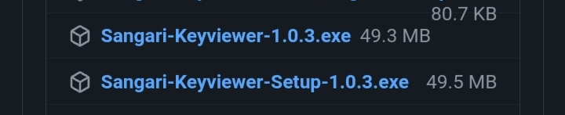

# sangari_keyviewer
~~와 상아리 키뷰어!!~~

이 저장소의 이미지들은 모두 [상아리](https://www.youtube.com/c/%EC%83%81%EC%95%84%EB%A6%AC) 의 소유이나, 오픈소스로 공개에 동의하여 이 저장소에 포함되게 되었습니다  
2차 창작은 언제나 환영입니다! (이 저장소의 코드들은 모두 MIT 라이선스에 의해 공개됩니다)

# Preview
TODO: Add gif image here

# Install
[릴리즈 탭](https://github.com/qwreey75/sangari_keyviewer/releases/tag/v1.0.3)에 있는 빌드된 파일을 이용하시면 됩니다, 윈도우의 경우 일반 exe 는 포터블 (무설치), setup exe 는 설치 파일입니다  

# Special Thanks!
pikokr 님의 [KeyViewer](https://github.com/pikokr/KeyViewer) 를 이용했습니다!  
만드는 도중에 ioHook, 마우스트래킹, electron 같은 기술적인 정보로 많이 도움을 주셨어요!  
다시한번 감사합니다 ㅎㅎ  

binaryfunt 님의 [타이틀바 튜토리얼](https://github.com/binaryfunt/electron-seamless-titlebar-tutorial)을 참고했습니다!  
닫는 버튼을 만들 수 있게 도움을 주었어요!  
